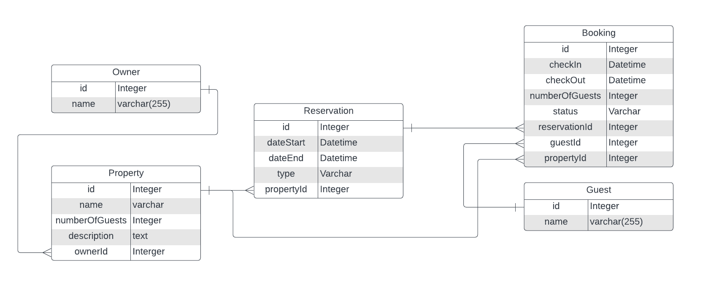
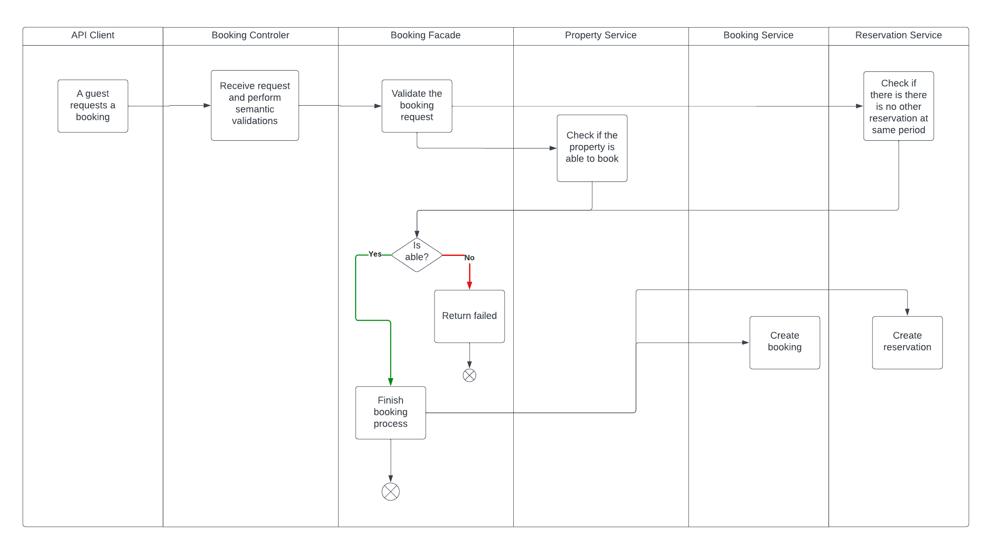

# Booking system

## What is this project?

This project is a REST API that provides endpoints to manage a Booking system. 

It was developed using Java 21, Spring Boot, H2 database and JUnit by following the instruction on the shared document by Hostfully.

## How the database is structured?

The database is structured based on the following diagram:



## How a booking process works?



## How to run this project?

In order to run this project, you need to have Java 21 installed on your machine.

You can run the project by running the following command:

```./gradlew bootRun```

## H2 Database

This project was configured with H2 database that can be accessed by:
http://localhost:8080/h2-console

## API Documentation

This project was configured with Open-API/Swagger documentation feature that generates an HTML page with the
documentation.

This documentation can be access by:
http://localhost:8080/swagger-ui/index.html

## Code coverage

According to the IntelliJ Code Coverage plugin, this project has 100% (Class) of the code coverage by tests.
